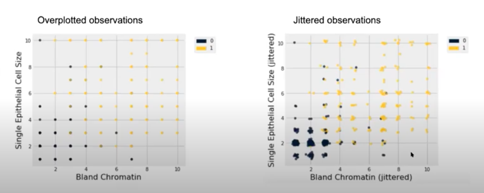
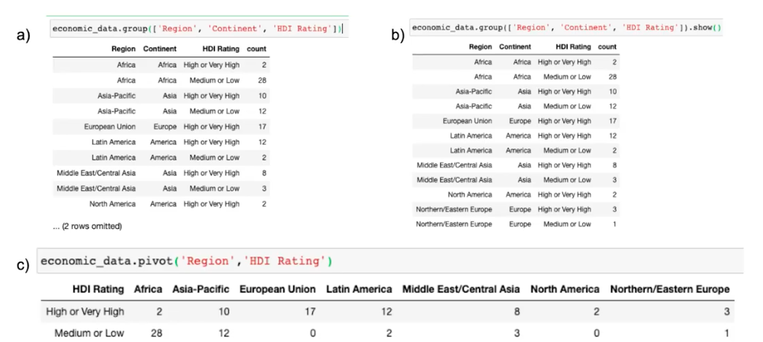

<!-- Check whether the assignment is up to date
{{'now' | date: '%Y'}}
{{page.due_date | date: '%Y'}}
 

Warning: this assignment is out of date.  It may still need to be updated for this year's class.  Check with your instructor before you start working on this assignment.


<!-- End of check whether the assignment is up to date 
-->

Final Project
=============================================================

The final project is a group projct where you will put the tools and methods you learned in this course into action. You will ask research questions based on datasets that we provide and then use the methods you learned this semester to answer these questions.
Your team can choose between 6 datasets. We provide a completed [example](http://jupyterhub.coms1016.barnard.edu/hub/user-redirect/git-pull?repo=https%3A%2F%2Fgithub.com%2FBC-COMS-1016%2Fmaterials-f20&urlpath=tree%2Fmaterials-f20%2Ffinal-project%2Fexample%2Fexample_report.ipynb&branch=master) for you as well. 
 All team members will receive the same grade on the project.
 **Note: Teams should not exceed a size of 2 members**

The final project is open-ended and will result in a research report.  We have provided structure and specific guidelines on what the research report must contain ([guidelines below](#research-report)) but there is a wide range of what you might do.  Check out the [example final project](http://jupyterhub.coms1016.barnard.edu/hub/user-redirect/git-pull?repo=https%3A%2F%2Fgithub.com%2FBC-COMS-1016%2Fmaterials-f20&urlpath=tree%2Fmaterials-f20%2Ffinal-project%2Fexample%2Fexample_report.ipynb&branch=master) for an idea of what constitutes a good project.  The example shows the scope of what you're required to do.

The different deliverables required for the final project are:

* [Part 1: Preregisteration](#preregistration). **Due Saturday 12/19 11:59PM** This is worth 5 points of your final project grade. The earlier your pre-register your questions and experiments with us (on gradescope), the earlier we can provide feedback and direction.
* [Part 2: Final Write Up](#final-write-up). **Due Wednesday 12/23 11:59PM** This is worth 20 points of your final project grade.

### Datasets
You have an option of 6 datasets to explore and analyze. We have provided a notebook on JupyterHub for each of these datasets. These datasets are:

- [Family & Household Wealth in the United States (2009-2013)](http://jupyterhub.coms1016.barnard.edu/hub/user-redirect/git-pull?repo=https%3A%2F%2Fgithub.com%2FBC-COMS-1016%2Fmaterials-f20&urlpath=tree%2Fmaterials-f20%2Ffinal-project%2FUS-wealth%2Fwealth-final-project.ipynb&branch=master)
- [Airbnb Listings and Evictions](http://jupyterhub.coms1016.barnard.edu/hub/user-redirect/git-pull?repo=https%3A%2F%2Fgithub.com%2FBC-COMS-1016%2Fmaterials-f20&urlpath=tree%2Fmaterials-f20%2Ffinal-project%2Fairbnb%2Fairbnb-final-project.ipynb&branch=master)
- [1987 National Indonesia Contraceptive Prevalence Survey](http://jupyterhub.coms1016.barnard.edu/hub/user-redirect/git-pull?repo=https%3A%2F%2Fgithub.com%2FBC-COMS-1016%2Fmaterials-f20&urlpath=tree%2Fmaterials-f20%2Ffinal-project%2Fcontraceptive-data%2Fcontraceptives-final-project.ipynb&branch=master)
- [Free Music Archive - A Dataset For Music](http://jupyterhub.coms1016.barnard.edu/hub/user-redirect/git-pull?repo=https%3A%2F%2Fgithub.com%2FBC-COMS-1016%2Fmaterials-f20&urlpath=tree%2Fmaterials-f20%2Ffinal-project%2Ffma-analysis%2Fmusic-final-project.ipynb&branch=master)
- [2020 Human Resources Dataset](http://jupyterhub.coms1016.barnard.edu/hub/user-redirect/git-pull?repo=https%3A%2F%2Fgithub.com%2FBC-COMS-1016%2Fmaterials-f20&urlpath=tree%2Fmaterials-f20%2Ffinal-project%2Fhr-dataset%2Fhr-final-project.ipynb&branch=master)
- [California Police Scorecard](http://jupyterhub.coms1016.barnard.edu/hub/user-redirect/git-pull?repo=https%3A%2F%2Fgithub.com%2FBC-COMS-1016%2Fmaterials-f20&urlpath=tree%2Fmaterials-f20%2Ffinal-project%2Fpolice-scorecard%2Fpolice-scorecard-final-project.ipynb&branch=master)

The notebooks each contain 4 main parts:

1. An overview and data description of the dataset
2. A preview section with code to read in all the datasets relevant to your specific project
3. A Research Report section which contains the outline and structure for the content of your final project. 
4. A submission section where you can download your notebooks as a zip file. 

Upon completion of the project notebook, you will need to download the submission zip file and upload to Gradescope. 

 

# Research Report
The main deliverable for this project is a research report. Here, we break down the components of the research report that you will submit.

## 1. Introduction

In the introduction you should describe and provide background to the dataset that you are exploring. If any of this information is mentioned in the dataset description, you should discuss who collected the data, why was it collected, where was it collected. Answers to these questions will help you develop your research questions that you want to explore. These answers will also help you determine the limits of some of your research questions.

The introduction should also mention what do the rows of each table represent, in other words, what are the individuals that make up the population of the dataset. 
You can use this as an opportunity to also introduce your initial observations in the tables as well.

The introduction should describe the variables most relevant to your analysis. Relevant variables are ones you will use in your hypothesis testing, prediction analysis, and plots in the data exploration section. 
The idea here is to familiarize your readers with the data and variables.
        
**Note: Keep the text length in this section between 250-300 words**

## 2. Hypothesis Testing and Prediction Questions 

In this section you should explain the overarching theme and direction of your research report. You will then describe your hypothesis testing question and state the null hypothesis and the alternative hypothesis. You will also use this section to **state** your prediction testing question.

Make sure to discuss how these questions relate to the theme of your report. Please bold the sentence that mentions the hypothesis testing and prediction testing questions. (Use double stars to **\*\*bold\*\*** text).

In this section, you will explain how you will go about testing your hypothesis. You will explain the test statistic you plan to use and simulate, as well as a motivatation and justification of what this test will help you determine. At this point, you will also decide on a significance cut-off level that you will use.

For your prediction question, you will explain and justify which model and features you will use to make a prediction. We encourage you to use more than one feature to make a prediction. 

You don't need to need to implement the tests in Python Code in this section. You will do that in section 4.
**Note: Keep the text length in this section between 250-300 words long.**

## 3. Exploratory Data Analysis 
> Visualize, and then quantify!

In this section you will create visualizations exploring the dataset. 
The main goal in this section is to not only present the plots and tables but to also convey to the readers what information they should be taking away from the plots and tables. 
You should create 4 visualizations: 2 plots and 2 tables. 
Please create plots and tables that you believe best summarize the data and are most related to your hypothesis testing and prediction question. 

**Plots** This section should have one quantitative plot and one qualitative plot. 
The quantitative plot could be a scatter plot, histogram, or other plots that we've used in the course. The qualitative plot may be generated from the provided data tables or from aggregated/joined tables.

**Tables** One table should be based on an aggregation function, e.g. `pivot` or `goup`. 
The other table should be the result of a `join`. If the resulting is too large to be informative, you may use a `pivot` and `group` to aggregate the data after `join`ing multiple tables.

Please provide a brief explanation of each plot and table. The explanations should describe what the plot/table is telling us and why we should care about it. 

We provide tips for your visualizations [below](#tips-and-suggestions)
 
**Note: The explanation for each plot and table should be between 1 and 3 sentences.**

## 4. Experiments

### A. Hypothesis Testing 

In this section, you will now test your hypothesis. Please begin this section by stating the hypothesis test being performed. You should motivate and explain the test and why it is appropriate here.
Make sure to also 1) restate the null hypothesis, 2) restate the alternative, 3) declare on a cut-off for a significance level.

Next, you will write python code to implement the test. 

After you run the test, it is now time to interpret your results.
Please write a brief description discussing the results. Consider whether the observed data is consistent with the null, why or why not.
Make sure to discuss any potential issues you might see as well.

Please stick to the testing procedures that we’ve covered in the course 

### B. Prediction Question

In this section, you will now implement a predictive model based on your prediction question.
Please begin by restating your prediction question. Make sure to mention what method you will use and why.

Next, you will write python code to implement your predictive model.
You will also write code to evaluate your model fit, and, if possible, performance.
It is important to use appropriate diagnostic tools and measurements.
For example, if you are using linear regression, you can plot a scatter plot or residual plot to show whether there is truly a linear relationship in the data.

Finally, you will interpret your results. Here, make sure to discuss 
whether your model fit the data well. Also discuss if we can use the model to predict the outcome of new data points, and if not, what changes should be made to the data to get a working model.

## 5. Conclusion

Your research report will end with a conclusion where you will discuss your findings from the final project.
In the conclusion, please briefly restate the results of your hypothesis test and prediction procedure. Make sure to 
relate them to the overarching theme in the report (since you've already produced and discussed the actual results in the previous section, this should be 2-4 sentences.)

Almost all research studies have limitations. Unforunately, these final projects are no different. You should end your conclusion by 
stating at least one potential limitation of your data or analysis.
Some ideas to consider include whether there are Potential sources of bias in your data, are your hypothesis testing and prediction methods appropriate, if you could do it again, what would you change.
This should be 1 - 3 sentences.

 
 
# Deliverables and Deadlines

### Preregistration
> Preregistration should 1) restrict as many researcher degrees of freedom as possible, 2) detail all aspects of a study’s method and analysis, 3) detail information on decisions made during the planning stages, and 4) specify how the results will be used and interpreted. Further, a preregistration must be publicly verifiable and permanent ... Preregistration should be used in any situation where researchers intend to collect data in order to make a claim, description, decision, or inference based on that data ... Preregistrations which do not address each of these points do more harm than good by falsely signalling credibility and quality.
> 
> McPhetres, Jonathon. 2020. “What Should a Preregistration Contain?.” PsyArXiv. June 1. doi:10.31234/osf.io/cj5mh.

In many fields, preregistering your research question and experiment is a common practice. Before begining to test a theory, researchers will often preregister their planned analysis and experiments. This *[information is especially helpful in research that emphasizes null hypothesis significance testing. A thorough preregistration promotes transparency and openness and protects researchers from suspicions of p-hacking](https://www.psychologicalscience.org/publications/psychological_science/preregistration)*.

For your project proposal and preregistration, please submit 
the research report with the first two sections filled out (introduction and hypothesis testing and prediction questions). You can also include the 3rd section (Exploratory Data Analysis) but it is not required. For this deadline, these sections do not need to be complete and formal. An outline that conveys the theme of your final projet, the questions you are asking, and the methods you will use to answer the questions will suffice.

Please submit the JupyterNotebook to Gradescope (Final Project Proposal /Preregistration) by **Saturday 12/19 11:59pm (EST)**. The earlier you submit your project preregistration/proposal, the earlier we will provide feedback and suggestions on how to improve your final-project.

### Final Write Up
The final project write up will be due by **Wednesday 12/23 11:59pm (EST)**

 

# Tips and suggestions
We provide some tips and suggestions that will help you while working on your final projects.

### Note of Reproducibility 

The hypothesis testing and prediction sections’ results rely on random permutations and/or simulations which utilize pseudorandom number generators from your computers to perform the random draws. These random draws ultimately can affect the random permutations/simulations and produce varied results each time you run your code. To keep your results more constant we can provide our own random number, called a seed, to ensure that the random permutations/simulations don't vary between running your experiments. 

In summary, we can use np.random.seed(seed), where seed is some integer before running code for permutations or simulations to allow for code reproducibility. 

**Note: For your convenience, `np.random.seed(seed)` has been added to the cells of your Project Report Notebooks already.**

### Plots and Tables Tips
Plots should be intuitive and informative to help readers take away as many information as possible from the data. You may be tempted to create plenty more plots to demonstrate that you did your due diligence to explore the data set, but having too many plots in your report could result in information overload. 
Select the plots and tables that you believe best summarizes the data and are related to your hypothesis testing and prediction question. 

##### Overplotting

Your data might be clustered very closely where all the points are imposed on top of one another. This can make it difficult to determine areas of the plot that are the most dense or where most observations lie. 
The plots above present 2 discrete variables and their observations are plotted. 
 On the left plot, the data values are overlaid (each data point on the plot we see actually corresponds to a couple of data points).
On the right plot, we add some random noise to the variables and then plot them. This reveals a jittered scatter plot in which we have a better understanding on where popular combinations of these 2 variables exist.
We now see that there were actually clusters of data points that we might have missed with the visualization on the left. 
    
**Note: We are only adding noise to the data for the purpose of visualization. The data after adding noise is not meant to be used in any other data analysis, hypothesis testing, etc. You should use the original dataset (pre-noise) when performing data analysis.**

##### Summary Tables

The 3 summary tables above present the number of countries in each region or continent stratified by HDI Rating. However one approach is more effective than the others are making this comparison and effectively presenting the results. 

Table A might not be ideal because we’re not showing a complete view of the data (2 rows are hidden that could contain important results). 
Table B does include the hidden rows from Table A but it is still not ideal because it is difficult to compare the Region, Continent, and HDI Ratings. Having too many rows or columns can take away from key information. In addition, the Region and Continent columns seem to be very similar so ideally we could choose one that best represents the data. 
Table C includes just the Region variable and is much easier to read. We can easily compare the counts of countries which have high or low HDI Ratings in each Region. 

## Acknowledgments
These datasets have been gathered and cleaned by the data8 summer 2020 course staff. Thank you!
